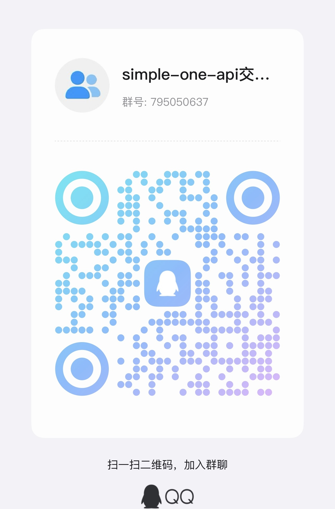

<p align="right">
   <strong>中文</strong> | <a href="./README.EN.md">English</a> 
</p>

# simple-one-api:通过标准的 OpenAI API 格式访问的各种国产大模型，开箱即用

## 简介

目前市面上免费的使用国产的免费大模型越来越多，one-api对于个人用起来还是有点麻烦，就想要一个不要统计、流量、计费等等的适配程序即可。

还有一点是：即使有些厂商说兼容openai的接口，但是实际上还是存在些许差异的！！！

**simple-one-api**主要是解决以上2点，旨在兼容多种大模型接口，并统一对外提供 OpenAI 接口。通过该项目，用户可以方便地集成和调用多种大模型，简化了不同平台接口差异带来的复杂性。

### 免费大模型列表

| 大模型                   | 免费版本                                                                                                              | 免费限制                                                                                               | 控制台（api_key等）                                                                            | 文档地址                                                                                      |
|-----------------------|-------------------------------------------------------------------------------------------------------------------|----------------------------------------------------------------------------------------------------|------------------------------------------------------------------------------------------|-------------------------------------------------------------------------------------------|
| 讯飞星火大模型               | `spark-lite`                                                                                                      | tokens：总量无限<br/>QPS：2<br/>有效期：不限                                                                   | [访问链接](https://console.xfyun.cn/services/cbm)                                            | [文档查看](https://www.xfyun.cn/doc/spark/Web.html)                                           |
| 百度千帆大模型平台             | `yi_34b_chat`, `ERNIE-Speed-8K`, `ERNIE-Speed-128K`, `ERNIE-Lite-8K`, `ERNIE-Lite-8K-0922`, `ERNIE-Tiny-8K`       | Lite、Speed-8K：RPM = 300，TPM = 300000<br/>Speed-128K：RPM = 60，TPM = 300000                          | [访问链接](https://console.bce.baidu.com/qianfan/ais/console/applicationConsole/application) | [文档查看](https://cloud.baidu.com/doc/WENXINWORKSHOP/s/klqx7b1xf)                            |
| 腾讯混元大模型               | `hunyuan-lite`                                                                                                    | 限制并发数为 5 路                                                                                         | [访问链接](https://console.cloud.tencent.com/cam/capi)                                       | [链接](https://cloud.tencent.com/document/api/1729/105701)                                  |
| Cloudflare Workers AI | `所有模型`                                                                                                            | 免费可以每天使用1万次，一个月可以30万次；测试版本本的模型无限制                                                                  | [访问链接](https://dash.cloudflare.com/)                                                     | [文档查看](https://developers.cloudflare.com/workers-ai/configuration/open-ai-compatibility/) |
| 字节扣子(coze.cn)         | 豆包·Function call模型(32K)、通义千问-Max(8K)、MiniMax 6.5s(245K)、Moonshot（8K）、Moonshot（32K）、Moonshot（128K）                 | 当前扣子 API 免费供开发者使用，每个空间的 API 请求限额如下：QPS (每秒发送的请求数)：2<br/>QPM (每分钟发送的请求数)：60<br/>QPD (每天发送的请求数)：3000 | [访问链接](https://www.coze.cn/space)                                                        | [文档查看](https://www.coze.cn/docs/developer_guides/coze_api_overview)                       |
| 字节火山方舟                | doubao系列、Moonshot系列等                                                                                              | 2024年5月15日至8月30日期间，为您提供一次独特的机会，即高达5亿tokens的免费权益。                                                   | [访问链接](https://www.volcengine.com/docs/82379/1263512)                                    | [文档查看](https://www.volcengine.com/docs/82379/1263512)                                     |
| Llama Family          | "Atom-13B-Chat","Atom-7B-Chat","Atom-1B-Chat","Llama3-Chinese-8B-Instruct"                                        | 1.每天 8-22 点：接口限速每分钟 20 次并发<br/>2.每天 22-次日 8 点：接口限速每分钟 50 次并发                                       | [访问链接](https://llama.family/docs/secret)                                                 | [文档查看](https://llama.family/docs/chat-completion-v1)                                      |
| groq                  | gemma-7b-it、mixtral-8x7b-32768、llama3-70b-8192、llama3-8b-8192                                                     | rpm为30，rpd为14400，TOKENS PER MINUTE也有限制                                                             | [访问链接](https://console.groq.com/keys)                                                    | [文档查看](https://console.groq.com/docs/text-chat)                                           |
| Google Gemini         | gemini-1.5-pro、gemini-1.5-flash、gemini-1.0-pro、gemini-pro-vision                                                  | 15RPM（每分钟请求数）;100万 TPM（每分钟令牌）;1500 RPD（每天请求数）                                                      | [访问链接](https://aistudio.google.com/app/apikey)                                           | [文档查看](https://ai.google.dev/gemini-api/docs/models/gemini)                               |
| 硅基流动                  | Qwen2-7B-Instruct，Qwen2-1.5B-Instruct，Qwen1.5-7B-Chat，glm-4-9b-chat，chatglm3-6b，Yi-1.5-9B-Chat-16K，Yi-1.5-6B-Chat | RPM限制为100，QPS限制为3，更多可以进行申请                                                                         | [访问链接](https://cloud.siliconflow.cn/account/expensebill)                                 | [文档查看](https://docs.siliconflow.cn/reference/chat-completions-1)                          | 

#### 各个模型详细的申请和接入流程
为了更加方便申请和接入，也整理了各个模型的接入指南，可以查阅：

- **讯飞星火大模型**:[docs/讯飞星火spark-lite模型申请流程](docs/讯飞星火spark-lite模型申请流程.md)
- **百度千帆大模型平台**:[docs/百度千帆speed和lite模型申请流程](docs/百度千帆speed和lite模型申请流程.md)
- **腾讯混元大模型**:：[docs/腾讯混元hunyuan-lite模型申请流程](docs/腾讯混元hunyuan-lite模型申请流程.md)
- **Cloudflare_Workers_AI**：[docs/Cloudflare_Workers_AI申请使用流程.md](docs/Cloudflare_Workers_AI申请使用流程.md)
- **字节扣子(coze.cn)**：[docs/coze.cn申请API使用流程.md](docs/coze.cn申请API使用流程.md)
- **字节火山方舟**：[docs/火山方舟大模型接入指南.md](docs/火山方舟大模型接入指南.md)
- **Llama Family**：[docs/Llama Family接入指南.md](docs/llama_family接入指南.md)
- **groq**: [docs/groq接入指南.md](docs/groq接入指南.md)
- **Gemini**：[docs/Gemini接入指南.md](docs/Gemini接入指南.md)

### 接入使用

社群小伙伴反馈验证可用的客户端

- [Next Chat](https://github.com/ChatGPTNextWeb/ChatGPT-Next-Web)
- [Lobe chat](https://github.com/lobehub/lobe-chat)
- [gpt_academic](https://github.com/binary-husky/gpt_academic)
- [Chat x](https://apps.apple.com/us/app/chatx-ai-chat-client-top/id6446304087)


## 功能

### 文本生成

支持多种大模型：
- [x] [百度智能云千帆大模型平台](https://qianfan.cloud.baidu.com/)
- [x] [讯飞星火大模型](https://xinghuo.xfyun.cn/sparkapi)
- [x] [腾讯混元大模型](https://cloud.tencent.com/product/hunyuan)
- [x] [Google Gemini](https://ai.google.dev/gemini-api/docs/models/gemini)
- [x] [Claude.ai](https://docs.anthropic.com/en/api/messages)
- [x] OpenAI ChatGPT 系列模型
    - [x] [OpenAI](https://platform.openai.com/docs/guides/gpt/chat-completions-api)
    - [x] [Deep-Seek](https://platform.deepseek.com/api-docs/zh-cn/)
    - [x] [Cloudflare Workers AI](https://developers.cloudflare.com/workers-ai/configuration/open-ai-compatibility/)
    - [x] [智谱清言语](https://open.bigmodel.cn/dev/api#language)
    - [x] [阿里通义DashScope](https://help.aliyun.com/zh/dashscope/developer-reference/compatibility-of-openai-with-dashscope)
    - [x] [Azure OpenAI](https://learn.microsoft.com/zh-cn/azure/ai-services/openai/reference)
    - [x] [Llama Family](https://llama.family/docs/chat-completion-v1)
    - [x] [groq](https://console.groq.com/docs/text-chat)
    - [x] [零一万物](https://platform.lingyiwanwu.com/docs)
- [x] [MiniMax](https://platform.minimaxi.com/document/guides/chat-model/pro)
- [x] 字节coze
    - [x] [扣子(coze.cn)](https://www.coze.cn/docs/developer_guides/coze_api_overview)
    - [x] [扣子(coze.com)](https://www.coze.com/docs/developer_guides/coze_api_overview)
- [x] [字节火山方舟](https://www.volcengine.com/docs/82379/1263482)
- [x] [ollama](https://github.com/ollama/ollama/blob/main/docs/api.md)

如果兼容某个参加已经支持OpenAI的接口，那么可以在simple-one-api中直接使用。参考文档[docs/兼容OpenAI模型协议接入指南.md](docs/兼容OpenAI模型协议接入指南.md)

### 支持的功能
- 支持配置多个模型，可以随机负载均衡
- 支持一个模型可配置多个`api_key`，并且可以随机负载均衡
- 支持设置一个对外总`api_key`
- 支持`random`模型，后台自动寻找配置的可用的模型
- 支持模型名称重定向设置模型设置别名
- 支持全局设置模型名称重定向，并且支持all模式全部重定向
- 支持每一种模型服务设置服务的地址
- 兼容支持OpenAI的接口，同时支持/v1和/v1/chat/completions两种路径
- 对于不支持system的模型，simple-one-api会放到第一个prompt中直接兼容（更加统一，例如沉浸式翻译中如果system，不支持system的模型也能正常调用）
- 支持全局代理模式
- 支持每个service设置qps或qpm或者concurrency
- 支持`/v1/models`和`/v1/models/:model`接口

### 更新日志

查看 [CHANGELOG.md](docs/CHANGELOG.md) 获取本项目的详细更新历史。

### 交流群


## 安装

### 源码安装

1. 克隆本仓库：
```bash
git clone https://github.com/fruitbars/simple-one-api.git
```

#### 快速编译使用

首先得确保你已经安装了go，版本需要是1.21以上，具体安装教程参考官网地址：[https://go.dev/doc/install](https://go.dev/doc/install)
可以通过`go version`查看go的版本。

**linux/macOS**

```shell
chmod +x quick_build.sh
./quick_build.sh
```

将会在当前目录生成`simple-one-api`

**Windows**
双击`quick_build.bat`执行
```bat
quick_build.bat
```

将会在当前目录生成`simple-one-api.exe`

**交叉编译不同平台版本**

有时需要编译不同平台的版本，比如windows、linux、macOS； 确保安装好go之后，执行`build.sh`

 ```shell
 chmod +x build.sh
 ./build.sh
 ```
会自动编译出对于以上3中平台不同架构的可执行文件，生成在`build`目录中。


**接下来配置你的模型服务和凭证：**
在 `config.json` 文件中添加你的模型服务和凭证信息，参考下文的配置文件说明。

### 直接下载

[前往Releases页面](https://github.com/fruitbars/simple-one-api/releases)

## 使用方法

### 直接启动
默认读取和`simple-one-api`相同目录下的`config.json`启动
   ```bash
   ./simple-one-api
   ```
如果想指定`config.json`的路径，可以这样启动
   ```bash
   ./simple-one-api /path/to/config.json
   ```

### Docker 启动

以下是如何使用 Docker 部署 `simple-one-api` 的步骤：
**运行**
使用以下命令运行 Docker 容器，同时挂载你的配置文件 `config.json`：
```sh
docker run -d --name simple-one-api -p 9090:9090 -v /path/to/config.json:/app/config.json fruitbars/simple-one-api
```
**注意：** 请确保将 /path/to/config.json 替换为 config.json 文件在你主机上的绝对路径。

**查看容器日志**
你可以使用以下命令查看容器的日志输出：

```sh
docker logs -f simple-one-api
```
或
```sh
docker logs -f <container_id>
```
其中，<container_id> 是容器的 ID，可以通过 docker ps 命令查看。

#### Docker Compose 启动步骤

1. **配置文件**：在`docker-compose.yml`中首先确保你已经将你的 `config.json` 文件的路径替换成了正确的绝对路径。
2. **启动容器**：
   使用 Docker Compose 启动服务，你可以在包含 `docker-compose.yml` 文件的目录下运行以下命令：
   ```sh
   docker-compose up -d
   ```
   这个命令会在后台启动 `simple-one-api` 服务。

其他查看命令参考docker-compose的文档。

### 其他启动方式
其他启动方式:
- [nohup启动](docs/startup/nohup_startup.md)
- [systemd启动](docs/startup/systemd_startup.md)


### 调用 API

 现在，你可以通过 OpenAI 兼容的接口调用你配置的各大模型服务。服务地址: `http://host:port/v1`,`api-key`可以任意设置

 支持模型名称设置为`random`，后台会自动找一个`"enabled": true`的模型来使用。

## 配置文件示例（以讯飞星火spark-lite为例）


```json
{
    "load_balancing": "random",
    "services": {
      "xinghuo": [
        {
          "models": ["spark-lite"],
          "enabled": true,
          "credentials": {
            "appid": "xxx",
            "api_key": "xxx",
            "api_secret": "xxx"
          }
        }
      ]
    }
}
```

其他模型的配置文件示例可以参考:[https://github.com/fruitbars/simple-one-api/tree/main/samples](https://github.com/fruitbars/simple-one-api/tree/main/samples)


**配置文件在线生成**

感谢来自社群小伙伴提供在线生成配置

[https://simple-one-api-ui.vercel.app/](https://simple-one-api-ui.vercel.app/)

## 配置文件说明

参考文档：[config.json详细说明](docs/config.json详细说明.md)

各个厂商详细的配置说明：[https://github.com/fruitbars/simple-one-api/tree/main/docs](https://github.com/fruitbars/simple-one-api/tree/main/docs)

各个厂商详细的示例config：[https://github.com/fruitbars/simple-one-api/tree/main/samples](https://github.com/fruitbars/simple-one-api/tree/main/samples)

### 比较完整的配置文件示例

具体文档查看[config.json详细说明.md](docs/config.json详细说明.md),以下是一个完整的配置示例，涵盖了多个大模型平台和不同模型：

```json
{
  "server_port":":9090",
  "load_balancing": "random",
  "services": {
    "qianfan": [
      {
        "models": ["yi_34b_chat", "ERNIE-Speed-8K", "ERNIE-Speed-128K", "ERNIE-Lite-8K", "ERNIE-Lite-8K-0922", "ERNIE-Tiny-8K"],
        "enabled": true,
        "credentials": {
          "api_key": "xxx",
          "secret_key": "xxx"
        }
      }
    ],
    "xinghuo": [
      {
        "models": ["spark-lite"],
        "enabled": true,
        "credentials": {
          "appid": "xxx",
          "api_key": "xxx",
          "api_secret": "xxx"
        },
        "server_url": "ws://spark-api.xf-yun.com/v1.1/chat"
      }
    ],
    "hunyuan": [
      {
        "models": ["hunyuan-lite"],
        "enabled": true,
        "credentials": {
          "secret_id": "xxx",
          "secret_key": "xxx"
        }
      }
    ],
    "openai": [
      {
        "models": ["deepseek-chat"],
        "enabled": true,
        "credentials": {
          "api_key": "xxx"
        },
        "server_url": "https://api.deepseek.com/v1"
      }
    ],
    "minimax": [
      {
        "models": ["abab6-chat"],
        "enabled": true,
        "credentials": {
          "group_id": "xxx",
          "api_key": "xxx"
        },
        "server_url": "https://api.minimax.chat/v1/text/chatcompletion_pro"
      }
    ]
  }
}
```
## FAQ
### 在沉浸式翻译当中怎么使用？

参考[docs/在沉浸式翻译中使用simple-one-api](docs/在沉浸式翻译中使用simple-one-api.md)

### 是否支持并发限制？

具体文档查看[config.json详细说明.md](docs/config.json详细说明.md)

参考如下配置，免费的讯飞星火spark-lite模型，有2qps限制，因此可以这么设置：

```json
{
  "server_port": ":9090",
  "debug": false,
  "load_balancing": "random",
  "services": {
    "xinghuo": [
      {
        "models": ["spark-lite"],
        "enabled": true,
        "credentials": {
          "appid": "xxx",
          "api_key": "xxx",
          "api_secret": "xxx"
        },
        "limit": {
          "qps":2,
          "timeout": 10
        }
      }
    ]
  }
}
```

### 如何设置代理

从v0.9.1开始，更新了代理方式，每个service支持独立代理
参考文档《[simple‐one‐api代理配置说明](https://github.com/fruitbars/simple-one-api/wiki/simple%E2%80%90one%E2%80%90api%E4%BB%A3%E7%90%86%E9%85%8D%E7%BD%AE%E8%AF%B4%E6%98%8E )》


### 如何设置一个对外的apikey？

可以通过`api_key`字段来设置
```json
{
    "api_key":"123456",
    "load_balancing": "random",
    "services": {
       "xinghuo": [
         {
           "models": ["spark-lite"],
           "enabled": true,
           "credentials": {
             "appid": "xxx",
             "api_key": "xxx",
             "api_secret": "xxx"
           }
         }
       ]
   }
}
```
### 单个模型如何配置多个credentials自动负载？
 以客户端选择spark-lite为例，可以按照下面这样配置，会随机credentials

```json
{
    "api_key":"123456",
    "load_balancing": "random",
    "services": {
       "xinghuo": [
         {
           "models": ["spark-lite"],
           "enabled": true,
           "credentials": {
             "appid": "xxx",
             "api_key": "xxx",
             "api_secret": "xxx"
           }
         },
         {
           "models": ["spark-lite"],
           "enabled": true,
           "credentials": {
             "appid": "xxx",
             "api_key": "xxx",
             "api_secret": "xxx"
           }
         }
       ]
   }
}
```
### 如何让后台随机选择模型使用？
`load_balancing`就是为自动选择模型来配置的，支持`random`，自动随机选一个`enabled`为`true`的模型

```json
{
    "api_key":"123456",
    "load_balancing": "random",
    "services": {
       "xinghuo": [
         {
           "models": ["spark-lite"],
           "enabled": true,
           "credentials": {
             "appid": "xxx",
             "api_key": "xxx",
             "api_secret": "xxx"
           }
         }
       ]
   }
}
```


## Star History

[](https://star-history.com/#fruitbars/simple-one-api&Date)

## 贡献

我们欢迎任何形式的贡献。如果你有任何建议或发现了问题，请通过提交 issue 或 pull request 的方式与我们联系。