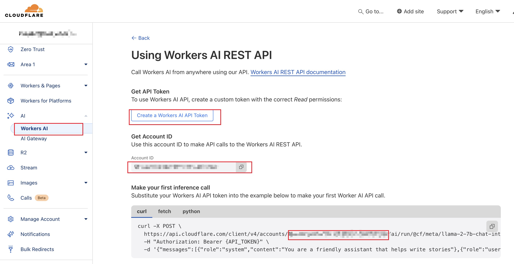

# Cloudflare_Workers_AI申请使用流程

## Workers AI免费信息

cloudflare_Workers_AI目前免费可以每天使用1万次，一个月可以30万次；测试版本本的模型无限制。

参考文档https://developers.cloudflare.com/workers-ai/platform/pricing

> Our free allocation allows anyone to use a total of 10,000 Neurons per day at no charge on our non-beta models. You can still enjoy unlimited usage on the beta models in the catalog until they graduate out of beta.
> 我们的免费分配允许任何人每天在我们的非测试版模型上免费使用总计 10,000 个 Neurons。您仍然可以无限制地使用目录中的测试版型号，直到它们退出测试版为止。


## Workers AI支持OpenAI标准协议？

查看从文档：[https://developers.cloudflare.com/workers-ai/configuration/open-ai-compatibility/](https://developers.cloudflare.com/workers-ai/configuration/open-ai-compatibility/)
后台地址：[https://dash.cloudflare.com/](https://dash.cloudflare.com/)

Workers AI 还支持 `/v1/chat/completions`，也就是说Workers AI 兼容OpenAI的接口，因此可以直接在simple-one-api中使用。

> OpenAI compatible endpoints
> OpenAI 兼容端点
>
> Workers AI also supports OpenAI compatible API endpoints for `/v1/chat/completions` and `/v1/embeddings`. For more details, refer to [Configurations](https://developers.cloudflare.com/workers-ai/configuration/open-ai-compatibility/).
> Workers AI 还支持 `/v1/chat/completions` 和 `/v1/embeddings` 的 OpenAI 兼容 API 端点。有关更多详细信息，请参阅配置。


而这篇文档详细描述和如何采用OpenAI兼容的接口进行调用：https://developers.cloudflare.com/workers-ai/configuration/open-ai-compatibility/

```shell
curl --request POST \
  --url https://api.cloudflare.com/client/v4/accounts/{account_id}/ai/v1/chat/completions \
  --header 'Authorization: Bearer {api_token}' \
  --header 'Content-Type: application/json' \
  --data '
    {
      "model": "@cf/meta/llama-3-8b-instruct",
      "messages": [
        {
          "role": "user",
          "content": "how to build a wooden spoon in 3 short steps? give as short as answer as possible"
        }
      ]
    }
'
```

## 在simple-one-api中配置
查看自己的api-tokens：[https://dash.cloudflare.com/profile/api-tokens](https://dash.cloudflare.com/profile/api-tokens)

从上面的示例参考，因此在可以按照下面的方式进行配置：

```json
{
  "server_port":":9090",
  "load_balancing": "random",
  "services": {
    "openai": [
      {
        "models": ["@cf/meta/llama-3-8b-instruct"],
        "enabled": true,
        "credentials": {
          "api_key": "xxx"
        },
        "server_url": "https://api.cloudflare.com/client/v4/accounts/{account_id}/ai/v1"
      }
    ]
  }
}
```

这里请替换自己的`api_key`和`server_url`，可以在cloudflare的后台查看，`Create a Workers AI API `Token对应的就是`api_key`，`Account ID`需要填入到server_url中。
