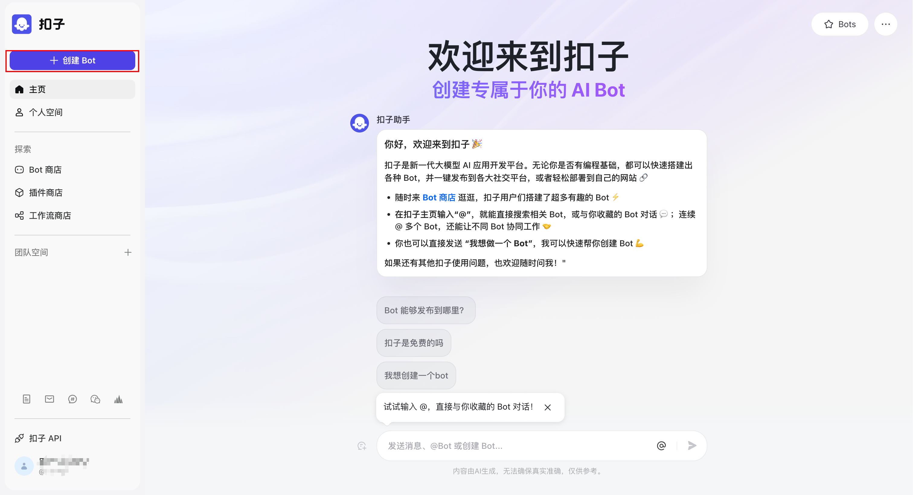
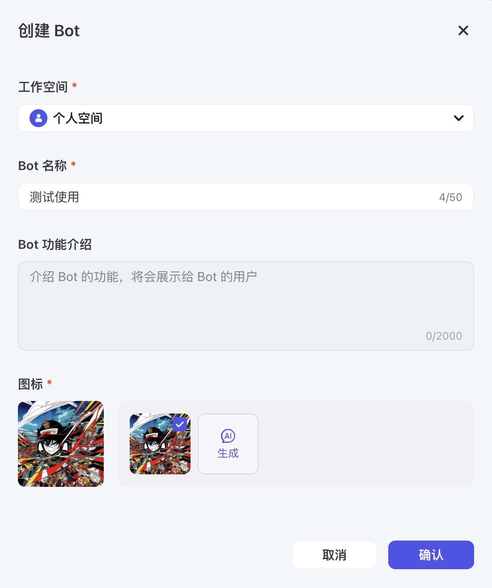
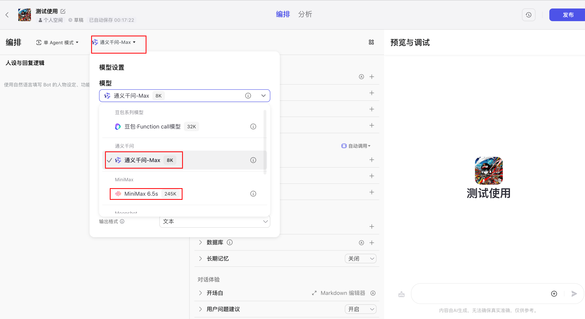
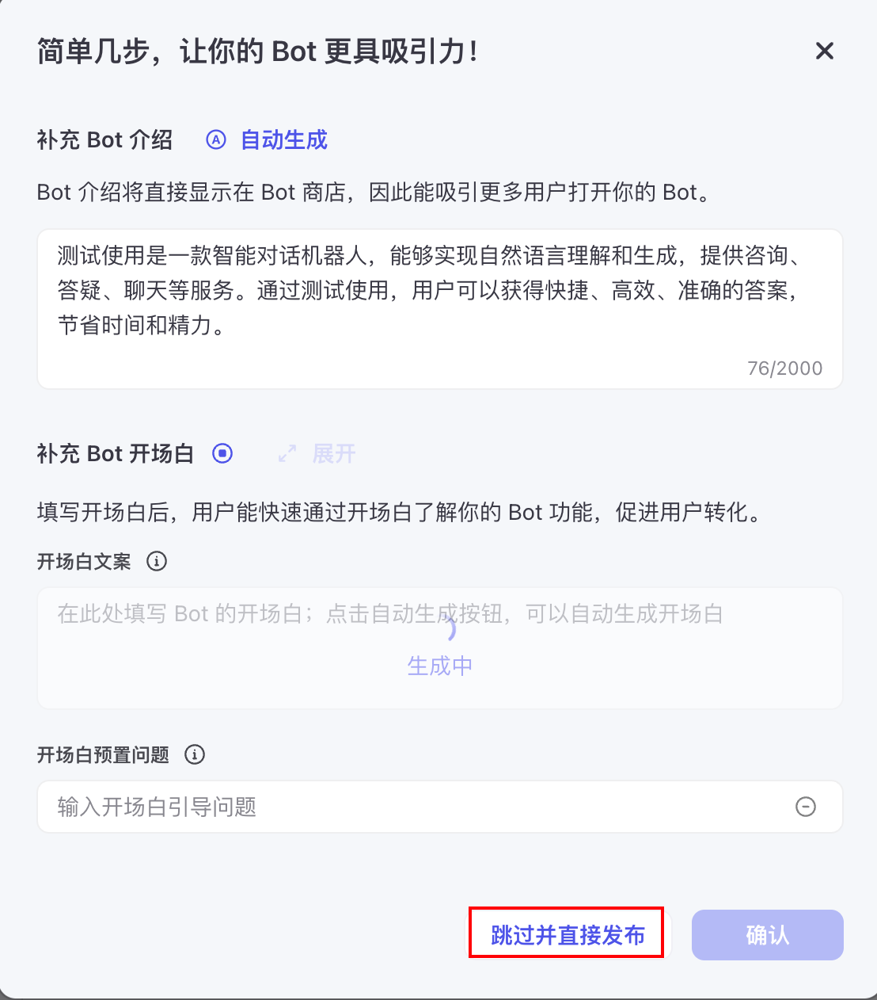
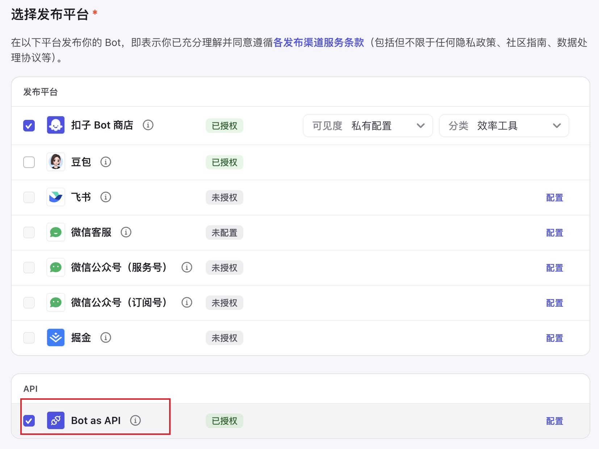
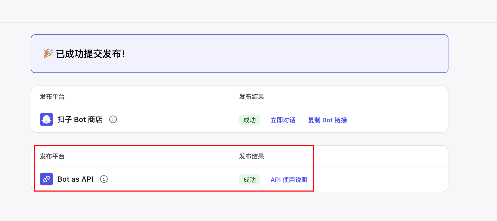

# coze.cn申请API使用流程

所有免费模型汇总：

[https://github.com/fruitbars/simple-one-api/blob/main/README.md](https://github.com/fruitbars/simple-one-api/blob/main/README.md)

## 获取API流程

第一步：创建Bot




第二步：创建




第三步：选择模型




第4步：发布Bot，选择 跳过并直接发布




第五步：勾选 Bot as API ，点击发布



第6步：成功提交发布，可以开始调用了




## 调用流程

参考API的文档：[https://www.coze.cn/docs/developer_guides/coze_api_overview](https://www.coze.cn/docs/developer_guides/coze_api_overview)

> 在发送请求前，请将示例中的以下参数值替换成真实数据：
>
> - {{Personal_Access_Token}}：生成的个人访问令牌。点击[这里](https://www.coze.cn/open/api)生成令牌。
> - {{Bot_Id}}：Bot ID。进入 Bot 的开发页面，开发页面 URL 中 bot 参数后的数字就是 Bot ID。例如https://www.coze.cn/space/73428668341****/bot/73428668*****，bot ID 为73428668*****。

models填写的是Bot_Id，而credentials中的token填写的是Personal_Access_Token；models中可以填写多个Bot_Id！

```
{
  "server_port": ":9099",
  "load_balancing": "random",
  "services": {
    "cozecn": [
      {
        "models": ["xxx"],
        "enabled": true,
        "credentials": {
          "token": "xxx"
        }
      }
    ]
  }
}
```

