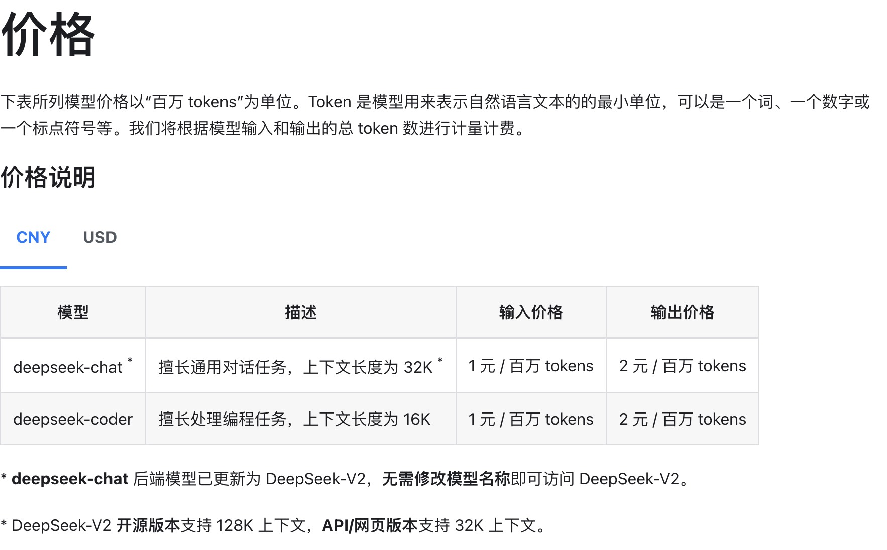

# deepseek模型申请使用流程
deepseek虽然目前不免费，但是很便宜，也是业界最早将大模型价格降下来的大模型，效果也不错。

## deepseek API申请流程
进入到deepseek的后台：https://platform.deepseek.com/api_keys
点击 API keys，然后点击创建API key


到这里即，获得了api key，接下来可以使用

## 在simple-one-api中配置使用
deepseek的接口是兼容openai，因此在services中加一项openai，按照如下方式配置即可。
```json
{
  "services": {
    "openai": [
      {
        "models": ["deepseek-chat"],
        "enabled": true,
        "credentials": {
          "api_key": "xxx"
        }
      }
    ]
  }
}
```
如果自己搭建的deepseek，可以设置独立的server_url
```json
{
  "services": {
    "openai": [
      {
        "models": ["deepseek-chat"],
        "enabled": true,
        "credentials": {
          "api_key": "xxx"
        },
        "server_url": "https://api.deepseek.com/v1"
      }
    ]
  }
}
```