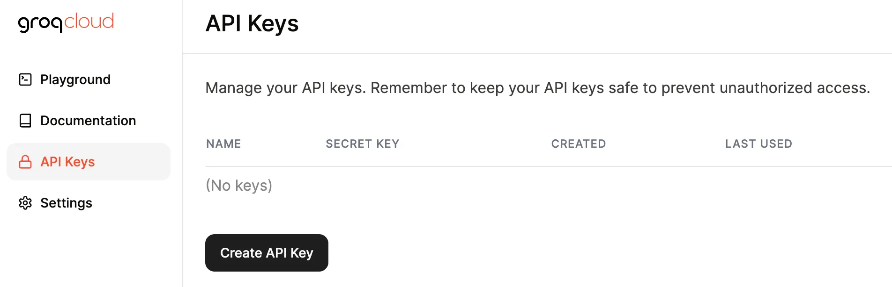

# groq接入指南


文档地址：https://console.groq.com/docs/quickstart

后台地址：https://console.groq.com/keys



## 在simple-one-api中使用

groq的接口是兼容openai，因此在services中加一项openai，按照如下方式配置即可。

```json
{
  "server_port": ":9099",
  "load_balancing": "random",
  "services": {
    "openai": [
      {
        "models": ["llama3-70b-8192","llama3-8b-8192","gemma-7b-it","mixtral-8x7b-32768"],
        "enabled": true,
        "credentials": {
          "api_key": "xxx"
        },
        "server_url":"https://api.groq.com/openai/v1"
      }
    ]
  }
}

```