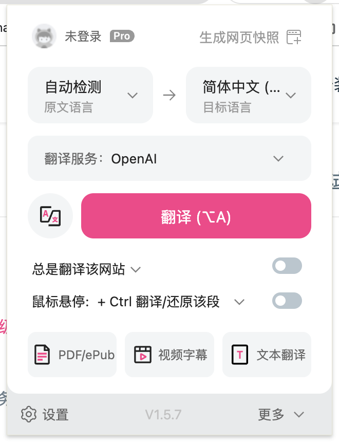
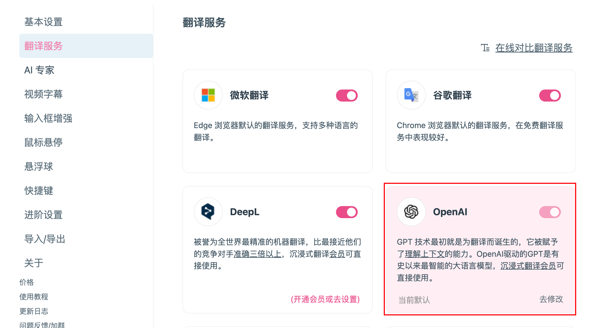
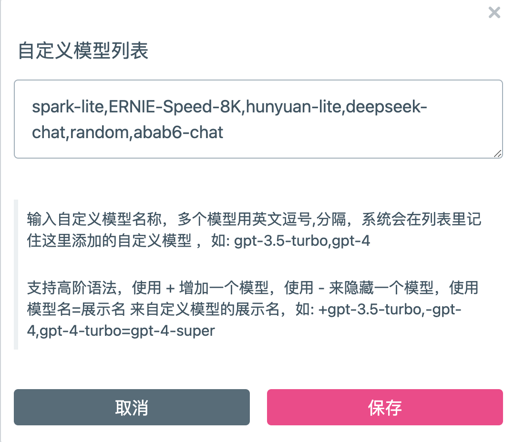
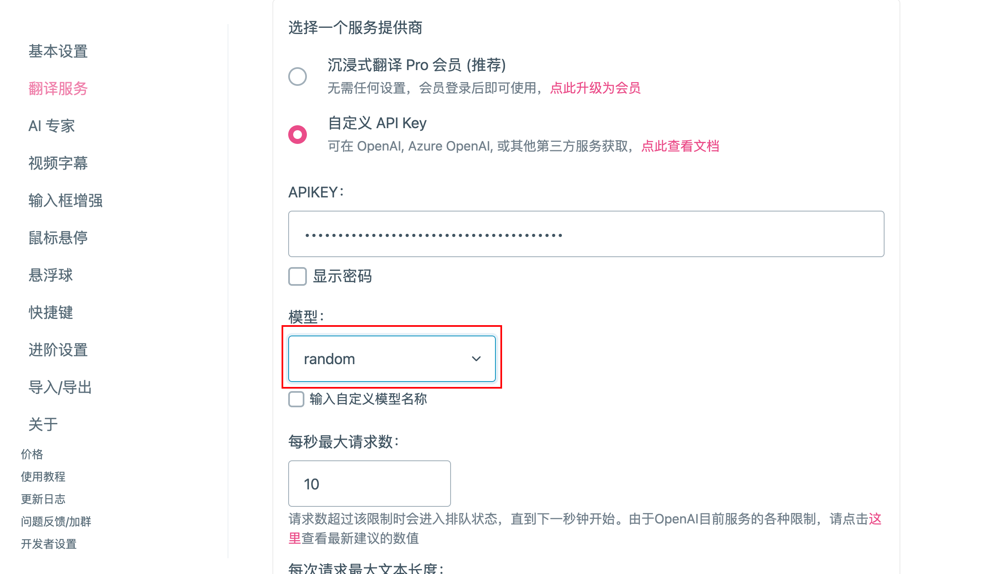
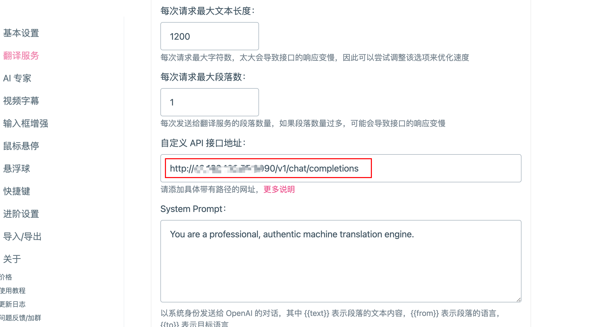
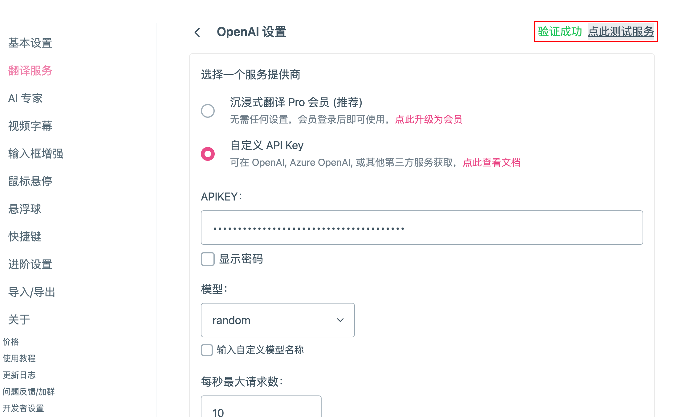

# 在沉浸式翻译中使用simple-one-api

大模型翻译相对于传统翻译效果是完全不一样的，整体效果会好很多。

目前市面上已经有多款免费大模型，如何才能用在翻译上呢？目前市面上最好用最火的当属**沉浸式翻译**这个产品。

如何集合各个免费大模型在**沉浸式翻译**当中使用呢？这里首先需要解决几个问题：

1. 协议统一：得按照openai的协议来，因此得有一个能将各家模型统一协议的转发软件（`simple-one-api`和`one-api`都可以）
2. 并发限制：能够自动负载，将请求转发给各家模型，这样避免并发限制

我们用`simple-one-api`来实现。

### **免费大模型**

| 大模型             | 免费版本                                                     | 控制台（api_key等）                                          | 文档地址                                                     | 备注                                                         |
| ------------------ | ------------------------------------------------------------ | ------------------------------------------------------------ | ------------------------------------------------------------ | ------------------------------------------------------------ |
| 讯飞星火大模型     | `spark-lite`                                                 | [链接](https://console.xfyun.cn/services/cbm)                | [链接](https://www.xfyun.cn/doc/spark/Web.html)              | tokens：总量无限<br>QPS：2<br>有效期：不限                   |
| 百度千帆大模型平台 | `yi_34b_chat`, `ERNIE-Speed-8K`, `ERNIE-Speed-128K`, `ERNIE-Lite-8K`, `ERNIE-Lite-8K-0922`, `ERNIE-Tiny-8K` | [链接](https://console.bce.baidu.com/qianfan/ais/console/applicationConsole/application) | [链接](https://cloud.baidu.com/doc/WENXINWORKSHOP/s/klqx7b1xf) | Lite、Speed-8K：RPM = 300，TPM = 300000<br>Speed-128K：RPM = 60，TPM = 300000 |
| 腾讯混元大模型     | `hunyuan-lite`                                               | [链接](https://console.cloud.tencent.com/cam/capi)           | [链接](https://cloud.tencent.com/document/api/1729/105701)   | 限制并发数为 5 路                                            |

## 沉浸式翻译配置

1. 首先进入到设置当中



2. 选择翻译服务，选中OpenAI，点去修改



3. 输入后台设置的自定义模型列表这里我们填入了列表`spark-lite,ERNIE-Speed-8K,hunyuan-lite,random`



4. 将模型设置为`random`，然后随机选一个模型使用



5. 设置部署simple-one-api的服务地址



6. 最后测试服务是否通畅



## simple-one-api配置

参考[simple-one-api使用方法](https://github.com/fruitbars/simple-one-api?tab=readme-ov-file#%E4%BD%BF%E7%94%A8%E6%96%B9%E6%B3%95)，将`simple-one-api`部署起来

## 多模型混用（自动负载）

`load_balancing`就是为自动选择模型来配置的，支持`random`，会从全局可用的模型中（即`enabled`为`true`），自动随机选一个的模型调用。

```json
{
  "api_key":"sk-123456"
  "server_port":":9090",
  "load_balancing": "random",
  "services": {
    "qianfan": [
      {
        "models": ["yi_34b_chat", "ERNIE-Speed-8K", "ERNIE-Speed-128K", "ERNIE-Lite-8K", "ERNIE-Lite-8K-0922", "ERNIE-Tiny-8K"],
        "enabled": true,
        "credentials": {
          "api_key": "xxx",
          "secret_key": "xxx"
        }
      }
    ],
    "xinghuo": [
      {
        "models": ["spark-lite"],
        "enabled": true,
        "credentials": {
          "appid": "xxx",
          "api_key": "xxx",
          "api_secret": "xxx"
        },
        "server_url": "ws://spark-api.xf-yun.com/v1.1/chat"
      }
    ],
    "hunyuan": [
      {
        "models": ["hunyuan-lite"],
        "enabled": true,
        "credentials": {
          "secret_id": "xxx",
          "secret_key": "xxx"
        }
      }
    ]
}
```


## 只用一个模型（自动负载）

例如客户端选择只用`spark-lite`，然后注册了多个账号有多个`appid`授权信息，可以按照下面这样配置，会随机`credentials`，这样每次请求会随机找一个可`"enabled": true`的`spark-lite`的进行调用。

```json
{
    "api_key":"123456",
    "load_balancing": "random",
    "xinghuo": [
      {
        "models": ["spark-lite"],
        "enabled": true,
        "credentials": {
          "appid": "xxx",
          "api_key": "xxx",
          "api_secret": "xxx"
        }
      },
      {
        "models": ["spark-lite"],
        "enabled": true,
        "credentials": {
          "appid": "xxx",
          "api_key": "xxx",
          "api_secret": "xxx"
        }
      }
    ]
}
```

