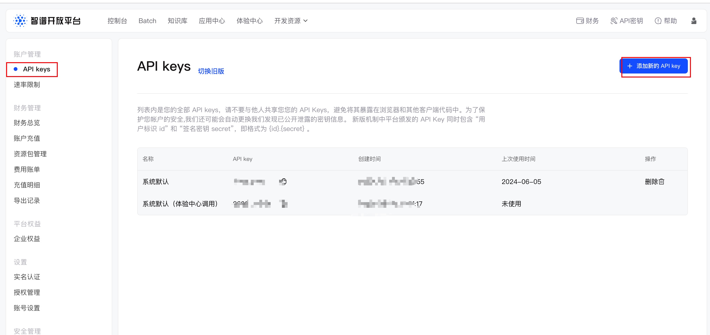

# 智谱glm模型申请使用流程

## glm API申请使用流程

默认智谱开放平台赠送18元金额，可以在财务总览中查看。

控制台地址：https://open.bigmodel.cn/usercenter/apikeys



接下来，参考API文档地址来接入：https://open.bigmodel.cn/dev/api#language

## 在simple-one-api中配置使用

智谱的接口是兼容openai，因此在services中加一项openai，按照如下方式配置即可。

```json
{
  "services": {
    "openai": [
      {
        "models": ["glm-4","glm-3-turbo"],
        "enabled": true,
        "credentials": {
          "api_key": "xxx"
        },
        "server_url":"https://open.bigmodel.cn/api/paas/v4/chat/completions"
      }
    ]
  }
}
```

其中simple-one-api默认的服务地址是：https://open.bigmodel.cn/api/paas/v4/chat/completions，另外这里填写https://open.bigmodel.cn/api/paas/v4/chat/completions和https://open.bigmodel.cn/api/paas/v4都是可以的，simple-one-api中自动做了兼容。

自定义服务地址设置示例：

```

{
  "services": {
    "openai": [
      {
        "models": ["deepseek-chat"],
        "enabled": true,
        "credentials": {
          "api_key": "xxx"
        },
        "server_url":"https://open.bigmodel.cn/api/paas/v4/chat/completions"
      }
    ]
  }
}
```

