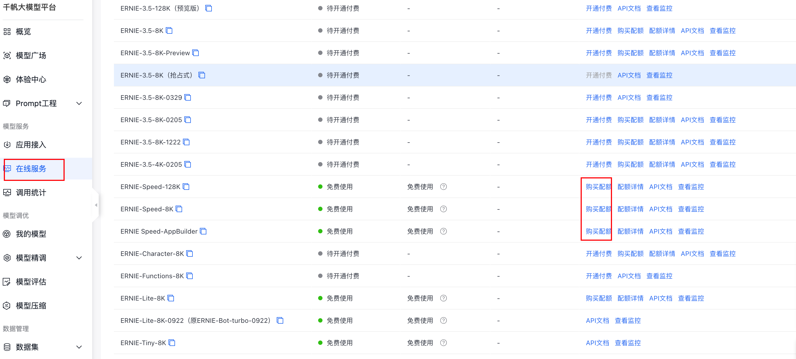
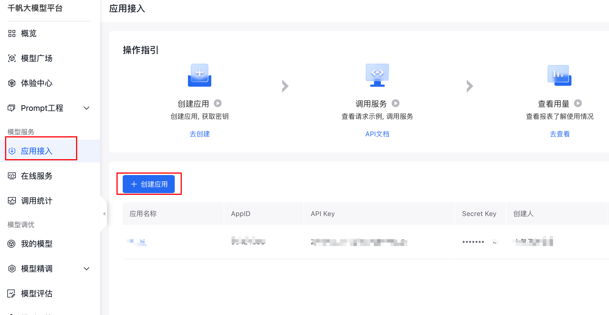
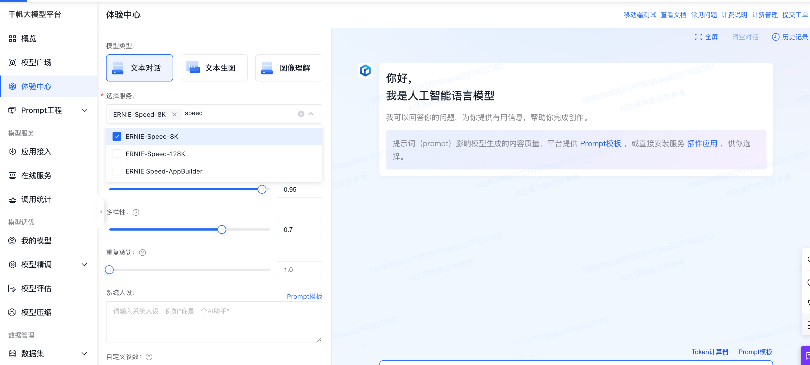

# 百度千帆speed和lite模型申请流程

> [!WARNING]
> 这是历史接入指南。模型、额度、控制台和认证方式可能已经变化，请先核对百度千帆官方文档；simple-one-api 的当前配置字段以[配置参考](./configuration-reference.md)为准。

到千帆平台上开通免费的模型[https://console.bce.baidu.com/qianfan/ais/console/onlineService](https://console.bce.baidu.com/qianfan/ais/console/onlineService)。注意开通需要实名认证！！！

到应用接入中创建应用，这里就有了`AppID`、`API Key`、`Secret Key`

也可以到体验中心体验[https://console.bce.baidu.com/qianfan/ais/console/onlineTest](https://console.bce.baidu.com/qianfan/ais/console/onlineTest)

