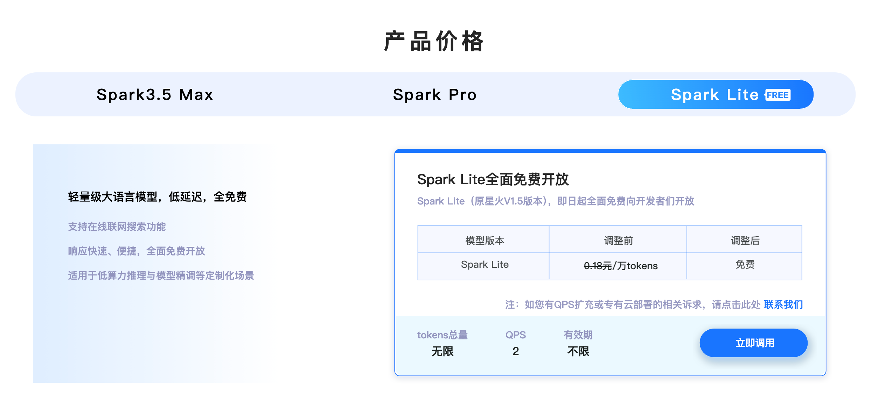
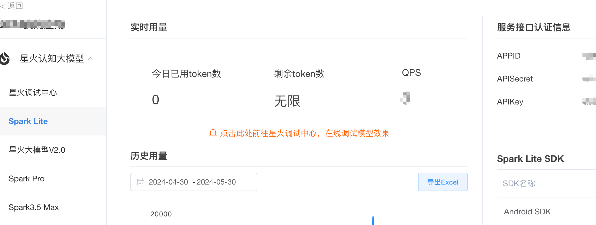
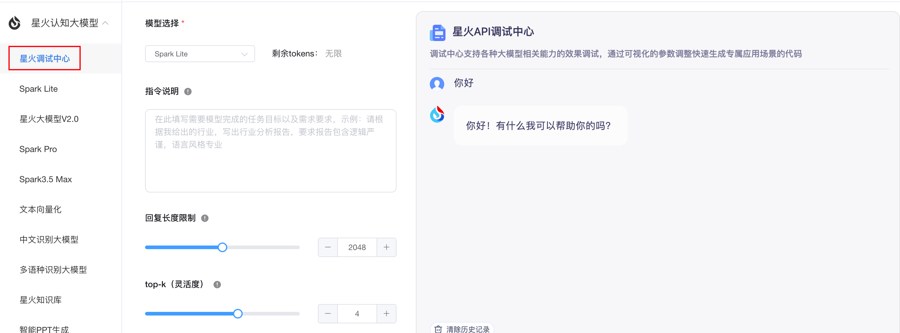

# 讯飞星火spark-lite模型申请流程

> [!WARNING]
> 这是历史接入指南。模型、额度、控制台和认证方式可能已经变化，请先核对讯飞星火官方文档；simple-one-api 的当前配置字段以[配置参考](./configuration-reference.md)为准。

spark-lite介绍页面[https://xinghuo.xfyun.cn/sparkapi?scr=true](https://xinghuo.xfyun.cn/sparkapi?scr=true)

到控制台[https://console.xfyun.cn/services/cbm](https://console.xfyun.cn/services/cbm)查看appid、apikey、apisecret信息

也可以到调试中心调试使用

